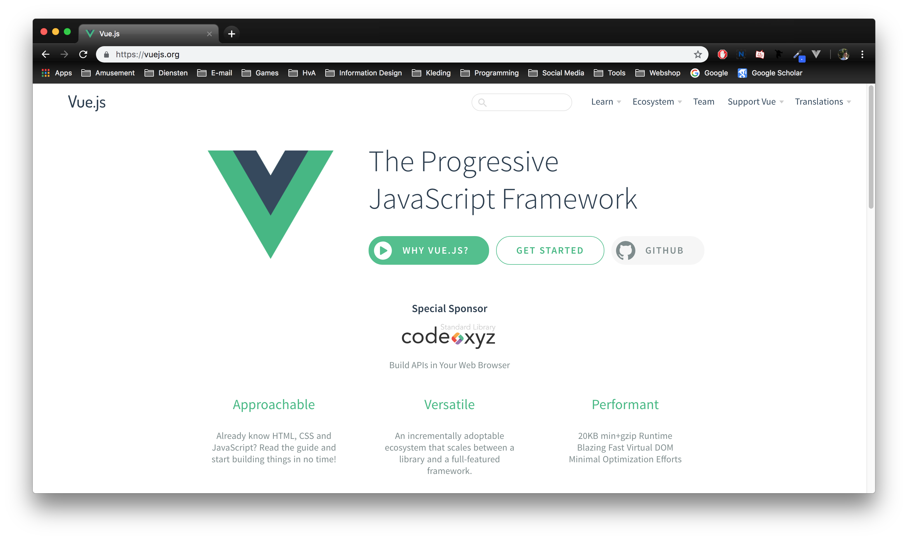
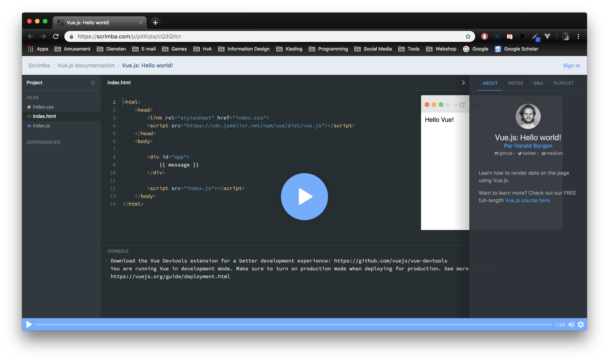
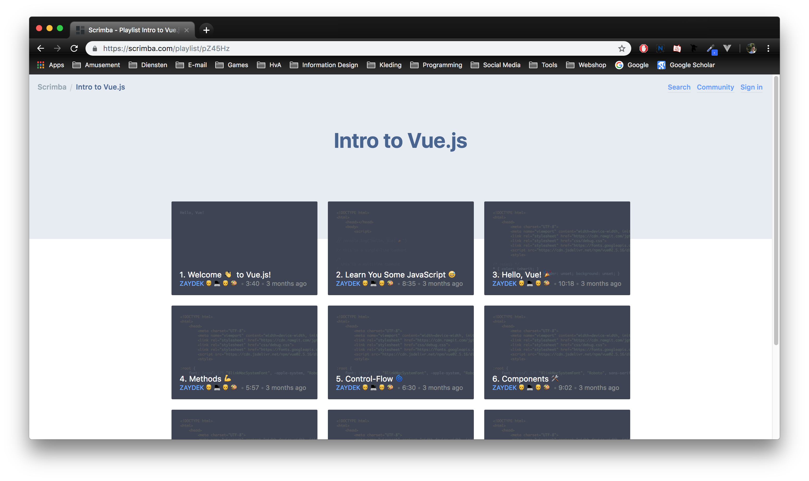

# frontend-applications | Risico indicatie App

This is the repo for my frontend applications project where I made a web application using Vue.js. The web application can be used to calculate the risk that a child has to be removed from their parental home


> Risico Indicatie App

## Table of Contents
* [To Do](#to-do)
* [Description](#description)
* [Installing](#installing)
* [Sources](#sources)
* [Licence](#licence)
* [Process](##process)

## To Do
This is a list of things in want to do in this project.
- [X] Git, npm, and a framework are used
- [X] Data is rendered with a framework
- [ ] Data can be read and changed
- [ ] Changes to data are reflected in the interface;
- [ ] Changes persist across page reloads
- [ ] Use routing or creating data

## Description
This web app can be used to calculate the risk that a child has to be removed from their parental home due to a number of different factors like educational status, social participation by the parents in society and if there are any relations with crime.

## Installing
To install this application enter the following into your _terminal_:
```
git clone https://github.com/BasPieren/frontend-applications.git

cd frontend-applications

npm install
```
If you want to also install the devDependencies use:
```
npm install --dev
```

### Packages and technologies
This project makes use of the following packages and technologies:

#### Dependencies
These dependencies are needed to run the web application.

* [Vue](https://www.npmjs.com/package/vue)

#### devDependencies
The devdependencies where used during the creation op the web application but are not needed to run it.

* [Prettier](https://www.npmjs.com/package/prettier)

All of these where recommended and used as examples by [Titus Wormer](https://github.com/wooorm) during the lectures and labs so thats why I also made use of them.

## Sources
This project makes use of the following sources:

* [Simple list filter with Vue.js](https://codepen.io/anon/pen/bxjpKG)
* [Code provided by Martijn Reeuwijk](https://github.com/MartijnReeuwijk)

## Process
Add the start of this project I got assigned  [Vue](https://www.npmjs.com/package/vue) as the framework to use for the frontend applications project.



First I wanted to familiarize myself with the framework itself before I would start on the project. I began with following the [installation](https://vuejs.org/v2/guide/installation.html) guide on the Vue website and followed that with the short introduction about the following points:

* What is Vue.js?
* Getting Started
* Declarative Rendering
* Conditionals and Loops
* Handling User Input
* Composing with Components

In short Vue is described as a **progressive framework** for building user interfaces. It enables people to render data to the DOM using simple syntax.

After reading the introduction I followed the [Scrimba](https://scrimba.com/p/pXKqta/cQ3QVcr) tutorial which explains the same basic concepts but using a video and voiceover which made it easier to follow.


> Vue introduction tutorial

The tutorial showed how to make 6 simple Vue applications.

### App 1
This simpele example shows how to link data and the DOM in a reactive way. This means when you edit the data, for example by using `app.message = "Hello World"`, It's get updated accordingly.

```
<div id="app">
  {{ message }}
</div>

<script type="text/javascript">

var app = new Vue({
  el:'#app',
  data: {
    message: "Hello Vue"
  }
})

</script>
```

This was all the code after I was done with the tutorial:

```
<!DOCTYPE html>
<html lang="en">
<head>
  <meta charset="UTF-8">
  <meta name="viewport" content="width=device-width, initial-scale=1.0">
  <meta http-equiv="X-UA-Compatible" content="ie=edge">
  <script src="https://cdn.jsdelivr.net/npm/vue/dist/vue.js"></script>
  <link rel="stylesheet" href="style/style.css">
  <title>Vue Tutorial</title>
</head>
<body>

  <!-- APP 1 -->

  <div id="app">
    {{ message }}
  </div>

  <!-- APP 2 -->

  <div id="app-2">
    <span v-bind:title="message">
      Hover your mouse over me for a few seconds
      to see my dynamically bound title!
    </span>
  </div>

  <!-- APP 3 -->

  <div id="app-3">
    <span v-if="seen">Now you see me</span>
  </div>

  <!-- APP 4 -->

  <div id="app-4">
    <ol>
      <li v-for="todo in todos">
        {{ todo.text }}
      </li>
    </ol>
  </div>

  <!-- APP 5 -->

  <div id="app-5">
    <p>{{ message }}</p>
    <button v-on:click="reverseMessage">Reverse Message</button>
  </div>

  <!-- APP 6 -->

  <div id="app-6">
    <p>{{ message }}</p>
    <input v-model="message">
  </div>

  <!-- APP 7 -->

  <div id="app-7">
    <ol>
      <todo-item
        v-for="item in groceryList"
        v-bind:todo="item"
        v-bind:key="item.id">
      </todo-item>
    </ol>
  </div>

  <div id="todolist">
    <h1>TODO:</h1>

    <ul>
      <li v-for="todo in todos">
        <button v-on:click="remove(todo)">X</button>{{todo}}
      </li>
    </ul>

    <input v-model="newtodo">
    <button v-on:click="add">Voeg {{newtodo}} toe</button>

  </div>

  <script type="text/javascript">

    // APP 1

    var app = new Vue({
      el:'#app',
      data: {
        message: "Hello Vue"
      }
    })

    // APP 2

    var app2 = new Vue({
      el: '#app-2',
      data: {
        message: 'You loaded this page on ' + new Date().toLocaleString()
      }
    })

    // APP 3

    var app3 = new Vue({
      el:"#app-3",
      data: {
        seen: true
      }
    })

    // APP 4

    var app4 = new Vue ({
      el: "#app-4",
      data: {
        todos: [
          { text: "Learn Javascript"},
          { text: "Learn Vue"},
          { text: "Build something awesome"}
        ]
      }
    })

    // APP 5

    var app5 = new Vue({
      el: "#app-5",
      data: {
        message: "Hello Vue.js"
      },
      methods: {
        reverseMessage: function () {
          this.message = this.message.split("").reverse().join("")
        }
      }
    })

    // APP 6

    var app6 = new Vue({
      el:"#app-6",
      data:{
        message: "Hello Vue!"
      }
    })

    // APP 7

    Vue.component("todo-item", {
      props: ["todo"],
      template: "<li>{{ todo.text }}</li>"
    })

    var app7 = new Vue({
      el: "#app-7",
      data: {
        groceryList: [
          {id: 0, text:'Vegetables'},
          {id: 1, text:'Cheese'},
          {id: 2, text:'Whatever else humans are supposed to eat'},
        ]
      }

    })

    new Vue({
        el : "#todolist",
        data : {
            newtodo : null,
            todos : ['Boter', 'Kaas', 'Eieren', 'Whisky']
        },
        methods : {
            add : function() {
                this.todos.push(this.newtodo);
                this.newtodo = null;
            },

            remove : function(todo) {
                this.todos = this.todos.filter(function(t) {
                    return t !== todo;
                });
            }
        }
    })

  </script>

</body>
</html>

```

After the first tutorial I started to watch the second tutorial which went deeper into stuff like:

* Methods
* Control-Flow
* Components


> Intro to Vue.js tutorial


## Licence

MIT © [Bas Pieren](https://github.com/BasPieren)
