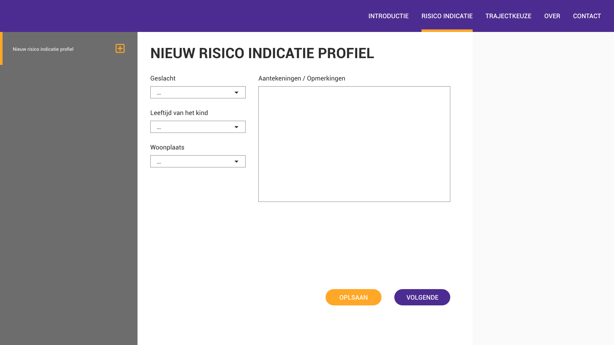
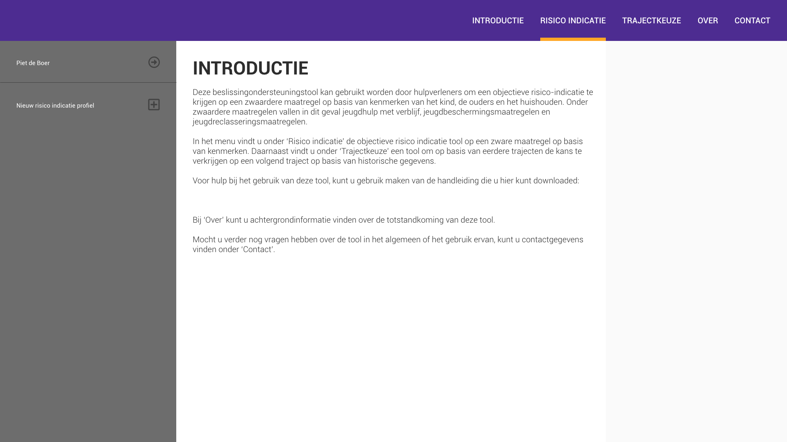
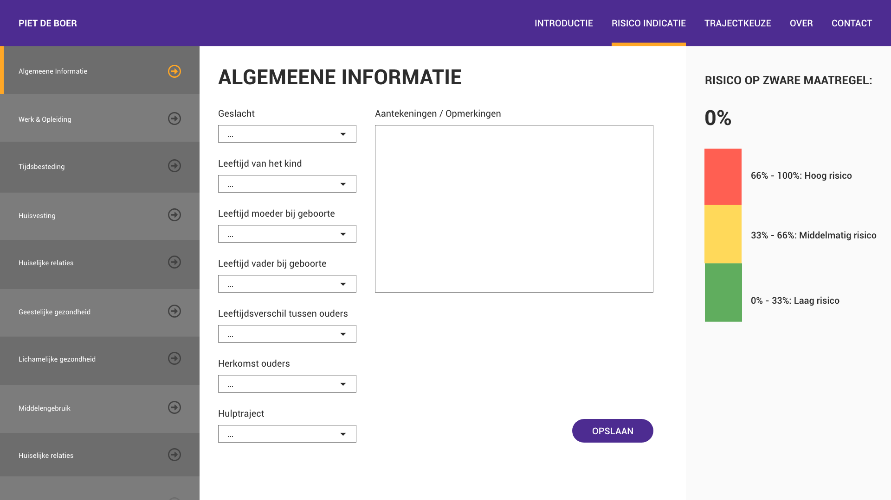
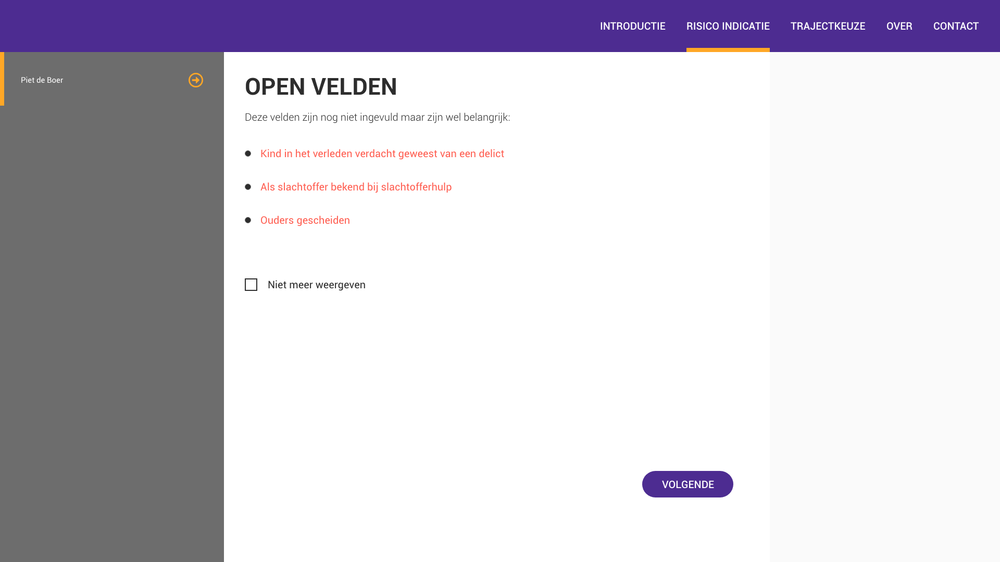
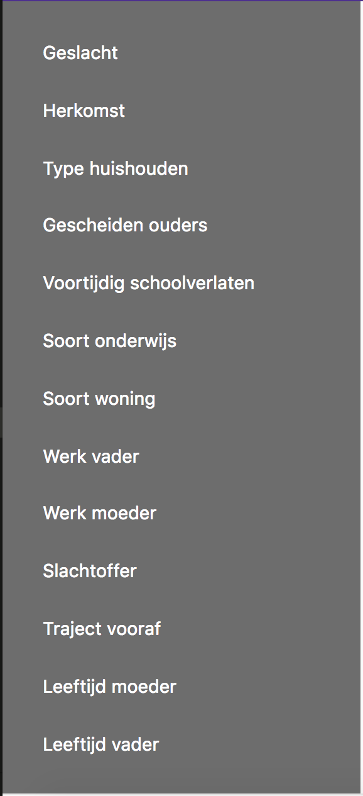

# frontend-applications | Risico indicatie App

This is the repositorie for my frontend applications project where I made a web application using *_Vue_*. The project was to build a web application that can be used to calculate the risk that a child has to be removed from their parental home.


> Risico Indicatie App

## Table of Contents
* [To Do](#to-do)
* [Description](#description)
* [Installing](#installing)
* [Sources](#sources)
* [Licence](#licence)
* [Process](#process)

## To Do
This is a list of things in want to do in this project.
- [X] Git, npm, and a framework are used
- [X] Data is rendered with a framework
- [ ] Data can be read and changed
- [ ] Changes to data are reflected in the interface;
- [ ] Changes persist across page reloads
- [ ] Use routing or creating data

## Description
This web app can be used to calculate the risk that a child has to be removed from their parental home due to a number of different factors like educational status, social participation by the parents in society and if they ever came in contact with crime.

## Installing
To install this application enter the following into your terminal:
```
git clone https://github.com/BasPieren/frontend-applications.git

cd frontend-applications

npm install
```
If you want to also install the devDependencies use:
```
npm install --dev
```

### Packages and technologies
This project makes use of the following packages and technologies:

* [Vue](https://www.npmjs.com/package/vue)
* [Prettier](https://www.npmjs.com/package/prettier)

I use Vue because it was assigned to me as part of the project, the devDependencies where recommended and used as examples by [Titus Wormer](https://github.com/wooorm) during the lectures so thats why I also made use of them.

## Sources
This project makes use of the following sources:

* [Vue introduction](https://vuejs.org/v2/guide/)
* [Vue Scrimba introduction](https://scrimba.com/p/pXKqta/cQ3QVcr)
* [Learn Vue.js for free](https://scrimba.com/g/glearnvue)
* [Simple list filter with Vue.js](https://codepen.io/anon/pen/bxjpKG)
* [Code provided by Martijn Reeuwijk](https://github.com/MartijnReeuwijk)

## Process
Add the start of this project I got assigned [Vue](https://www.npmjs.com/package/vue) as the framework to use for the frontend applications project.


First I wanted to familiarize myself with the framework itself before I would start on the project. I began with following the [installation](https://vuejs.org/v2/guide/installation.html) guide on the Vue website and followed that with the short introduction about the following basic Vue concepts:

* What is Vue.js?
* Getting Started
* Declarative Rendering
* Conditionals and Loops
* Handling User Input
* Composing with Components

In short Vue is described as a **progressive framework** for building user interfaces. It enables people to render data to the DOM using simple syntax.

After reading the introduction I followed the [Scrimba](https://scrimba.com/p/pXKqta/cQ3QVcr) tutorial which explains the same basic concepts but using a video and voiceover which made it easier to follow.


> Vue introduction tutorial

The tutorial showed how to make 6 simple Vue applications.

### App 1
This simpele example shows how to link data and the DOM in a reactive way. This means when you edit the data, for example by using `app.message = "Hello World"`, it's get updated accordingly.

```
<div id="app">
  {{ message }}
</div>

<script type="text/javascript">

var app = new Vue({
  el:'#app',
  data: {
    message: "Hello Vue"
  }
})

</script>
```

This was all the code after I was done with the tutorial:

```
<!DOCTYPE html>
<html lang="en">
<head>
  <meta charset="UTF-8">
  <meta name="viewport" content="width=device-width, initial-scale=1.0">
  <meta http-equiv="X-UA-Compatible" content="ie=edge">
  <script src="https://cdn.jsdelivr.net/npm/vue/dist/vue.js"></script>
  <link rel="stylesheet" href="style/style.css">
  <title>Vue Tutorial</title>
</head>
<body>

  <!-- APP 1 -->

  <div id="app">
    {{ message }}
  </div>

  <!-- APP 2 -->

  <div id="app-2">
    <span v-bind:title="message">
      Hover your mouse over me for a few seconds
      to see my dynamically bound title!
    </span>
  </div>

  <!-- APP 3 -->

  <div id="app-3">
    <span v-if="seen">Now you see me</span>
  </div>

  <!-- APP 4 -->

  <div id="app-4">
    <ol>
      <li v-for="todo in todos">
        {{ todo.text }}
      </li>
    </ol>
  </div>

  <!-- APP 5 -->

  <div id="app-5">
    <p>{{ message }}</p>
    <button v-on:click="reverseMessage">Reverse Message</button>
  </div>

  <!-- APP 6 -->

  <div id="app-6">
    <p>{{ message }}</p>
    <input v-model="message">
  </div>

  <!-- APP 7 -->

  <div id="app-7">
    <ol>
      <todo-item
        v-for="item in groceryList"
        v-bind:todo="item"
        v-bind:key="item.id">
      </todo-item>
    </ol>
  </div>

  <div id="todolist">
    <h1>TODO:</h1>

    <ul>
      <li v-for="todo in todos">
        <button v-on:click="remove(todo)">X</button>{{todo}}
      </li>
    </ul>

    <input v-model="newtodo">
    <button v-on:click="add">Voeg {{newtodo}} toe</button>

  </div>

  <script type="text/javascript">

    // APP 1

    var app = new Vue({
      el:'#app',
      data: {
        message: "Hello Vue"
      }
    })

    // APP 2

    var app2 = new Vue({
      el: '#app-2',
      data: {
        message: 'You loaded this page on ' + new Date().toLocaleString()
      }
    })

    // APP 3

    var app3 = new Vue({
      el:"#app-3",
      data: {
        seen: true
      }
    })

    // APP 4

    var app4 = new Vue ({
      el: "#app-4",
      data: {
        todos: [
          { text: "Learn Javascript"},
          { text: "Learn Vue"},
          { text: "Build something awesome"}
        ]
      }
    })

    // APP 5

    var app5 = new Vue({
      el: "#app-5",
      data: {
        message: "Hello Vue.js"
      },
      methods: {
        reverseMessage: function () {
          this.message = this.message.split("").reverse().join("")
        }
      }
    })

    // APP 6

    var app6 = new Vue({
      el:"#app-6",
      data:{
        message: "Hello Vue!"
      }
    })

    // APP 7

    Vue.component("todo-item", {
      props: ["todo"],
      template: "<li>{{ todo.text }}</li>"
    })

    var app7 = new Vue({
      el: "#app-7",
      data: {
        groceryList: [
          {id: 0, text:'Vegetables'},
          {id: 1, text:'Cheese'},
          {id: 2, text:'Whatever else humans are supposed to eat'},
        ]
      }

    })

    new Vue({
        el : "#todolist",
        data : {
            newtodo : null,
            todos : ['Boter', 'Kaas', 'Eieren', 'Whisky']
        },
        methods : {
            add : function() {
                this.todos.push(this.newtodo);
                this.newtodo = null;
            },

            remove : function(todo) {
                this.todos = this.todos.filter(function(t) {
                    return t !== todo;
                });
            }
        }
    })

  </script>

</body>
</html>

```

After the first tutorial I started to watch the second tutorial which went deeper into stuff like:

* Methods
* Control-Flow
* Components


> Intro to Vue.js tutorial

After following all the tutorials I started work on the project itself
sinds I got the feeling I had the hang of the basics. I created the `frontend-applications` directory and installed Vue with `node install vue` which installed vue in de `node_modules` directory.

My document looked something like this:

```
<!DOCTYPE html>
<html lang="en">
<head>
  <meta charset="UTF-8">
  <meta name="viewport" content="width=device-width, initial-scale=1.0">
  <link rel="stylesheet" href="../style/style.css">
  <script src="../../node_modules/vue/dist/vue.js"></script>
  <title>Fe-applications | Risico indicatie app</title>
</head>
<body>

<script src="../script/script.js" type="text/javascript"></script>

</body>
</html>

```

After the setup I started with a quick sketch of how I ruffly wanted the web application to look like.


> First very low-fi sketch

When I got a general idea of how I wanted my web application to look I made a design in Adobe Xd.

### Home Page


### Creating profile page


### Save after creating profile


### Selected profile categorie


### Reopen profile after save


When the design was done I started with creating the components that I was gonne need for the webb application. I made the following components and initiated a Vue instance on a wrapper div:

```
Vue.component('v-header', {

});

Vue.component('v-aside', {

});

Vue.component('v-main', {

});

var vm = new Vue({
  el: '#v_app'
});
```

The HTML looked like this:

```
<!DOCTYPE html>
<html lang="en">
<head>
  <meta charset="UTF-8">
  <meta name="viewport" content="width=device-width, initial-scale=1.0">
  <link rel="stylesheet" href="../style/style.css">
  <script src="../../node_modules/vue/dist/vue.js"></script>
  <title>Fe-applications | Risico indicatie app</title>
</head>

<div id="v_app">

  <v-header></v-header>

  <v-aside></v-aside>

  <v-main></v-main>

</div>

<script src="../script/script.js" type="text/javascript"></script>

</body>
</html>
```

After I created the first components that I was gonna need I started to fill them with the content that I wanted to display per components. The most important components where the aside and the main.

In the aside section I wanted to display all the categories as a means to navigate to the desired categorie to and fill in the questions that are part of that categorie.

First I needed the JSON data that was provided by Arjen. I was looking up ways to import the data from the separate JSON file. I found solutions that where using `import vue from './assets/data.json'` but this would not work becaus I kept getting the same error that `import` was not a valid value.

After some time of trying I heard other people where having the same issue and the just put the JSON data inside an array. So I did the same and got the following:

```
var data = [
  {
    Coefficients: 'GESLACHT Mannen',
    Categorie: 'Geslacht',
    Name: 'Man',
    Gewicht: '-0,12611'
  },
  {
    Coefficients: 'Herkomst ouders: Beide ouders niet Nederlands',
    Categorie: 'Herkomst',
    Name: 'Beide ouders niet Nederlands',
    Gewicht: '0,16972'
  },
  {
    Coefficients:
      'Herkomst ouders: Een van de ouders Nederlands en de andere niet Nederlands',
    Categorie: 'Herkomst',
    Name: 'Een van de ouders Nederlands en de andere niet Nederlands',
    Gewicht: '-0,08943'
  },

  etc.

];
```

After that I added the data property to the component to import the that through a function and return the data array. I also added a `v-for` to the `<li>` tag to be able to loop through the entire array and put out all the categories into the list.

```
Vue.component('v-aside', {
  data: function() {
    return {
      data
    };
  },
  template: `
    <aside>
      <ul>
        <li v-for="categorie in categorieName">
          {{ categorie }}
        </li>
      </ul>
    </aside>`
});
```
This gave the desired affect except for one thing: it printed all the categories multiple times because of the way the data was set up. So I needed to find a fix for this.

After some time I found the following source: [Simple list filter with Vue.js](https://codepen.io/anon/pen/bxjpKG). This code provided me with the solution:

```
computed: {
  // START USE OF SOURCE: https://codepen.io/anon/pen/bxjpKG
  categorieName: function() {
    return [...new Set(this.data.map(i => i.Categorie))];
  }
  // END USE OF SOURCE
},
```
I will go through how this code works. First I added the `computed` property to the component. `computed` properties work the same as `methods` accept for one difference:

> Computed properties are cached, and only re-computed on reactive dependency changes. Note that if a certain dependency is out of the instance’s scope (i.e. not reactive), the computed property will not be updated (Vue, 2018).

Inside the computed property I created a new function named `categorieName: function () {}` and inside the function we return a new array that checks if a categorie is duplicated and only gives back one per categorie.

All of this thougher look like the following:

```
Vue.component('v-aside', {
  data: function() {
    return {
      data
    };
  },

  computed: {
    // START USE OF SOURCE: https://codepen.io/anon/pen/bxjpKG
    categorieName: function() {
      return [...new Set(this.data.map(i => i.Categorie))];
    }
    // END USE OF SOURCE
  },

  template: `
    <aside>
      <ul>
        <li v-for="categorie in categorieName">
          {{ categorie }}
        </li>
      </ul>
    </aside>`
});
```

This gave the following outcome:



After the aside component was finished I started to work on the main component. The main component was pretty straight forward and only requird a template property.

```
Vue.component('v-main', {
  template: `
    <main>
      <h2>Risico indicatie</h2>
      <p>Deze beslissingondersteuningstool kan gebruikt worden door hulpverleners om een objectieve risico-indicatie te krijgen op een zwaardere maatregel op basis van kenmerken van het kind, de ouders en het huishouden.</p>
      <p>Onder zwaardere maatregelen vallen in dit geval jeugdhulp met verblijf, jeugdbeschermingsmaatregelen en jeugdreclasseringsmaatregelen.</p>
      <v-question></v-question>
    </main>`
});
```

Inside the template I also declared the `<v-question>` tag which would be the component to hold the questions that the user would have to fill out.

So after the main I started work on the question component. The first setup looked something like this:

```
Vue.component('v-question', {
  data: function() {
    return {
      data,
    };
  },
  computed: {
    // START USE OF SOURCE: https://codepen.io/anon/pen/bxjpKG
    categorieName: function() {
      return [...new Set(this.data.map(i => i.Categorie))];
    },
    awnserName: function() {
      return [...new Set(this.data.map(i => i.Name))];
    },
    // END USE OF SOURCE
  },
  template: `
    <section>
      <article v-for="categorie in categorieName">
        <label>{{ categorie }}</label>
        <select>
          <option v-for="antwoorden in awnserName">
            {{ antwoorden }}
          </option>
        </select>
      </article>
    </section>
    `
});
```

I used the same code that I used for the aside component but the problem here was that each category would have all the answers of all the questions inside the same dropdown selection. After not being able to find a solution online I added a some code that was written by [Martijn Reeuwijk](https://github.com/MartijnReeuwijk):

```
mergeData: function() {

// START USE OF SOURCE: Martijn Reeuwijk
var dataPrepped = [];
for (var i = 0; i < data.length; i++) {

  var newCategory = true;
  for (var j = 0; j < dataPrepped.length; j++) {
    if (dataPrepped[j].Categorie === data[i].Categorie) {
      newCategory = false;
    }
  }

  if (newCategory) {
    dataPrepped.push({
      'Categorie': data[i].Categorie,
      'Answers': []
    });
  }

  for (var j = 0; j < dataPrepped.length; j++) {
    if (dataPrepped[j].Categorie === data[i].Categorie) {
      dataPrepped[j].Answers.push({
        'Coefficients': data[i].Coefficients,
        'Name': data[i].Name,
        'Gewicht': data[i].Gewicht,
      });
    }
  }
    // END USE OF SOURCE
  }
  return dataPrepped;
  }
```

I will explain what the code does. First we create the `mergeData: function () {}`. Inside the function we create the dataPrepped array which we will fill with all the categories grouped as objects with there respective answers. After that we create a for loop that will loop through the length of the data array.

After that we create the newCategory var with the boolean true. Then we create an other loop that checks if the dataPrepped array holds a category that is the same as a category inside the data array. If this is true we wont add a the category and set newCategory to false. Than we have a if statement that pushes the catagory into the dataPrepped array as a new object with categorie and answers as values. The answers value is also an array that we will fill with the correct answers.

To do this we create a new for loop that goes over the dataPrepped array again and checks if it has the same categorie as the data array.
We then push Coefficients, Name and Gewicht in to the Answers array. Finaly we return the dataPrepped array.

Combined with the rest of the component it looks like this:

```
Vue.component('v-question', {
  data: function() {
    return {
      data,
    };
  },
  computed: {
    mergeData: function() {

    // START USE OF SOURCE: Martijn Reeuwijk
    var dataPrepped = [];
    for (var i = 0; i < data.length; i++) {

      var newCategory = true;
      for (var j = 0; j < dataPrepped.length; j++) {
        if (dataPrepped[j].Categorie === data[i].Categorie) {
          newCategory = false;
        }
      }

      if (newCategory) {
        dataPrepped.push({
          'Categorie': data[i].Categorie,
          'Answers': []
        });
      }

      for (var j = 0; j < dataPrepped.length; j++) {
        if (dataPrepped[j].Categorie === data[i].Categorie) {
          dataPrepped[j].Answers.push({
            'Coefficients': data[i].Coefficients,
            'Name': data[i].Name,
            'Gewicht': data[i].Gewicht,
          });
        }
      }
        // END USE OF SOURCE
      }
      return dataPrepped;
      }
  },
  template: `
    <section>
      <article v-for="categorie in mergeData">
        <label>{{ categorie.Categorie }}</label>
        <select>
          <option v-for="antwoorden in mergeData">
            {{ categorie.Answers }}
          </option>
        </select>
      </article>
    </section>
    `
});
```

Inside the template we put a v-for on the article tag and create a new article for each category. We also put a v-for on the option tag to load all the answers that are part of the category into the select field.

## Licence

MIT © [Bas Pieren](https://github.com/BasPieren)
